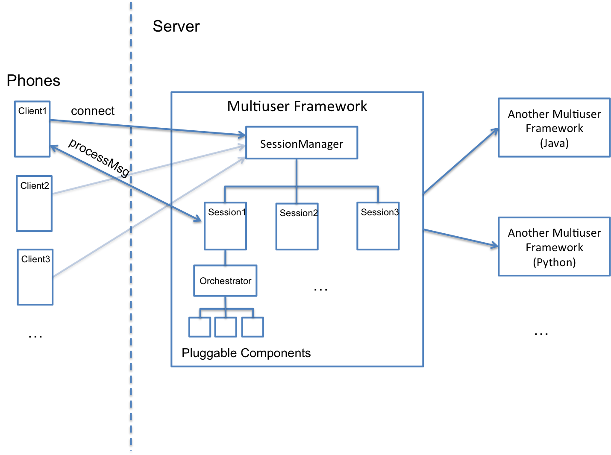

# multiuser-framework (MUF)
 
Status for master branch:

[//]: # (this is a comment: see this link for badges using travis-CI, codecov, etc: https://github.com/mlindauer/SMAC3/blob/warmstarting_multi_model/README.md) 
 
 
 
[](https://www.codacy.com/app/ojrlopez27/multiuser-framework?utm_source=github.com&amp;utm_medium=referral&amp;utm_content=ojrlopez27/multiuser-framework&amp;utm_campaign=Badge_Grade)

Implementation:


 
 


## Overview

The MUF is a framework that allows developers to easily scale their mono-user architecture to a multi-user architecture with little effort. The MUF is a plugin-based architecture written in Java (though it supports interaction with almost any programming language thanks to its communication layer that uses ZeroMQ). 

<p align="center">
       
</p>

## Features

The most relevant features of the MUF are:

* **Session Management:** a Session Manager automatically creates a new session every time a client connects and then manages its lifecycle (i.e., connection, disconnection, control of inactivity, resources management, etc.) 

* **Low latency:** a whole communication action (i.e., to send a message from the client and receive a response from the server) takes around 10-13 ms in total. This test was made using a MacBook Pro 2.5 GHz Intel core i7, 16 GB 1600 MHz DDR, but it could be improved if you use an AWS instance. These latency range were the same even when the framework was tested with 1,000 clients. 

* **Robustness and Reliability:** the MUF supports error handling (e.g., crash errors trigger specific system recovery actions), disconnection and automatic reconnection (if network fails or communication freezes or gets locked), management of queue overflows and memory leaks, data loss prevention (when a client disconnects due to an unexpected reason, the system will keep messages in memory until the client reconnects or a timeout is met), gracefully shutdown (if system crashes and cannot be restarted, all resources such as sockets, queues, shared objects, DB, etc. are closed and released before the system exits). 

* **Simple:** all the communication complexity is hidden, that is, you don’t have to deal with details about sockets, http requests, ports, etc. You just call functions of other modules and components as if they were local objects, regardless the fact they may be services running remotely. 

* **Pluggable Architecture:** the MUF allows you to define pluggable modules that can be added anytime and using different mechanisms, so you can easily evolve your system over time and make it more flexible to changes. There are two kind of pluggable modules: Orchestrators that are in charge of arbitrating the internal processing of each request message from a client, and PluggableComponents that are your domain-specific modules (e.g., in a dialogue system domain, PluggableComponents may be ASR, NLG, NLU, DM, etc.) 

* **Component state:** you can define your components’ behavior as simple as adding an “annotation” to your code. Your components may be Stateful (it keeps an internal representation or model so a new component is created for each session), Stateless (no representation of the state, so a component is shared by multiple sessions) or Pool (you define a maximum number of instances to be created of your component). 

* **Blackboard:** the MUF uses a Blackboard system, a common knowledge base that is iteratively updated by a diverse group of specialist knowledge sources: the Pluggable modules. Blackboard updates all the listeners that are subscribed to specific messages that are posted by other components. Also, the blackboard keeps a history of all interactions between components (components never communicate directly to each other but through the Blackboard) so components may extract past messages that are stored in the Blackboard.

* **Automatic Scalability:** thanks to the MUF design and the communication patterns it uses (e.g, PUB-SUB, REQ-RESP, ROUTER-DEALER, etc.) your system can easily scale from 1 client to thousands without any extra effort. Now, if you use Amazon Lambda server (AWS) as well, then this scalability feature will be improved even further. MUF’s Philosophy: you write your app for one client and run it for thousands. 

* **User Model:** you can conveniently create your customized user models and store them on disc. A User Model component filters messages that go through the Blackboard and then extracts specific information from these messages (e.g., user preferences and interests). 

* **Sync and Async execution:** MUF provides an API so you can define different flows of control in your orchestrator, for instance, you can use an event-oriented approach, or a direct-invocation approach. Also, you can define how your components are executed (sync or asynchronously) and, in those cases where components run asynchronously, you can force the synchronization without concurrency issues. 

* **Inversion of Control:** the MUF uses dependency injection technique, so your implementation delegates the responsibility of providing its dependencies to the MUF (injector). It allows your system to be reconfigured without recompilation, make easier to unit test your components in isolation, allow concurrent or independent development, etc. Also, MUF provides you mechanisms to intercept execution of methods according to AOP (Aspect Oriented Programming). 

* **Logging:** you can define multiple levels of logging and different ways to store logs (files, json, database, etc.). All interaction that goes through the blackboard is logged by default, but you can add additional logging criteria. 

* **Contracts:** the MUD defines contracts (shared libraries with classes and global constants) to avoid issues when parsing and matching messages and content. 

* **API's:** the MUF provides different API’s that encapsulate natural patterns for communication, parsing json, serialization, common utils, etc. 

* **Multiplatform and Multilanguage:** thanks to MUF uses a potent messaging and concurrency libraries such as ZMQ, you can easily communicate the MUF implementation (Java code) with clients written in almost any programming language with low extra effort (there is an example in the github repo of how to connect Java MUF with a Python MUF, but so many other languages may be supported). Also, you can communicate your MUF with another MUF which runs on another machine, that means that your MUF may behave as a server when receiving requests from clients (phones) or as a client when it sends or forwards messages to other MUF’s and waits for responses from them, so you can get a nested architecture of MUF’s.


## How to use the MUF

Currently the MUF is hosted on a CMU AFS (Andrew File System) space but it will be ported to AWS soon. You can add this gradle dependency to your build.gradle file:

```gradle
repositories{
  maven {
          credentials {
              username 'inmind'
              password 'askInMindAdminForAPassword...'
          }
          url "http://www.cs.cmu.edu/afs/cs/project/inmind-cmu-yahoo/www/maven2"
      }
}
dependencies{
  compile 'edu.cmu.inmind.framework:multiuser:3.0.12-rc1'
}
```

## Create, start and stop a MUF instance

You can create as many instances of MUF as you want by calling the startFramework method of MultiuserFrameworkContainer class. The startFramework method receives three parameters:

* An array of PluginModule instances: each PluginModule must contain one orchestrator and at least one (or multiple) pluggin components.
* A Config object with all the settings for the creation of the MUF
* A ServiceInfo object that contains information about a MUF that runs as a service, that is, you can connect multiple MUF's, abd when you do that, you can define a master MUF which is the instance that will be listening to client requests, and a slave MUF which connects to the master MUF as a service.

The simplest way to create a MUF is using the default configuration (i.e., both MUF and clients will connect to localhost on port 5555, the session timeout is 5 minutes, etc.) as follows:

```java
MultiuserFramework muf = MultiuserFrameworkContainer.startFramework(
                new PluginModule[]{new PluginModule.Builder( orchestrator, TestPluggableComponent.class, "test").build()}
                new Config.Builder().build() );
```

Now, you can create a MUF by specifying a detailed configuration as follows:

```java
MultiuserFramework muf = MultiuserFrameworkContainer.startFramework(
                getModules(), createConfig() );
...

public PluginModule[] getModules(){
      return new PluginModule[]{
              new PluginModule.Builder( TestOrchestrator.class )
                      .addPlugin(YourPluggableComponent1.class, "id_comp_1")
                      .addPlugin(YourPluggableComponent2.class, "id_comp_2")
                      //.addPlugin....
                      .build()
      };
}

public Config createConfig(String serverAddress, int port) {
    return new Config.Builder()
            // you can refer to values in your config.properties file:
            setPathLogs(Utils.getProperty("pathLogs"))
            // or you can add values directly like this:
            .setServerAddress("tcp://192.168.123.98")
            .setSessionManagerPort(5566)
            .setDefaultNumOfPoolInstances(10)           
            .setSessionTimeout(10, TimeUnit.MINUTES)
            .setExceptionTraceLevel(Constants.SHOW_ALL_EXCEPTIONS)
            //.set...
            .build();
}
```

And finally, you can stop the MUF like this:
```java
MultiuserFrameworkContainer.stopFramework( muf );
```
Or stop all MUF's instances like this:
```java
MultiuserFrameworkContainer.stopFrameworks( );
```

## Create a Client, and send and receive messages to/from MUF

Creating a client that connects to MUF is a simple as follows (using the default configuration):
```java
ClientCommController client =  new ClientCommController.Builder().build();
```
or you can also specify a detailed configuration:
```java
int port = 5555;
String serverAddress = "tcp//:xxx.xxx.xxx.xxx:"; //replace this line with your server address
String clientAddress = "tcp//:xxx.xxx.xxx.xxx:"; //replace this line with your client address
ClientCommController client =  new ClientCommController.Builder()
      .setServerAddress(serverAddress + port)
      .setClientAddress( clientAddress + port )
      .setServiceName(sessionId)
      .setRequestType( Constants.REQUEST_CONNECT )
      .build();
```
Now, let's create a listener that will process the asynchronous responses sent by MUF:

```java
client.receive(new ResponseListener() {
       @Override
       public void process(String message) {
           SessionMessage sessionMessage = Utils.fromJson(message, SessionMessage.class);          
           Log4J.info(ResponseListener.class, "This is the response from MUF: " + sessionMessage.getPayload() );
       }
   });
```
Finally, we can send messages from client to MUF as simple as:

```java
// sessionId and messageId are unique ids. If using Android client, the sessionId must correst to the deviceId 
SessionMessage message = new SessionMessage( messageId, "Message from client : hello world", sessionId );
client.send( sessionId, message);
```

## Unit Tests

Take a look at MUFTestSuite class for running a suite of unit tests for the MUF.

## Examples

The examples illustrate how SARA (Socially-Aware Robotic Assistant) components communicate in the backed with an android client in the front end by using the MUF. Under folder Examples, you will find 5 projects that will be required to run the examples:

* AndroidClient: this is the client that will be sending request messages to MUF
* SaraProject: this is the main (master) MUF that will be listening to messages coming from client
* DialogueSystem: this is a secondary (slave) MUF that register as a service with the master MUF. This MUF, written in java, forwards all the messages to the real dialogue system written in python.
* PythonDM: this is the dialogue system written in python and contains two modules: NLU and DM
* SaraCommons: this module conly contains contracts (i.e., interfaces, constants, etc.) in order to reach an agreement between modules regarding to the name of variables, services, messages, etc.

On SaraProject, you will find 15 examples that take you through the whole set of features of MUF. You can run each example under package edu.cmu.inmind.multiuser.sara.examples.

- [**Ex01_MessageTranslation:**](Examples/SaraProject/src/main/java/edu/cmu/inmind/multiuser/sara/examples/Ex01_MessageTranslation.java) You can programmatically control what to do with the message. For instance, you can translate the input that comes from android client into a known object (e.g., SaraInput object).
- [**Ex02_ExtractMessage:**](Examples/SaraProject/src/main/java/edu/cmu/inmind/multiuser/sara/examples/Ex02_ExtractMessage.java) this is a simple scenario that illustrates: 
  - 1. how to use your own implementation of a Message Logger 
  - 2. how to extract messages coming from the client
  - 3. how to respond to the client
- [**Ex03_OneComponentActivation:**](Examples/SaraProject/src/main/java/edu/cmu/inmind/multiuser/sara/examples/Ex03_OneComponentActivation.java) MUF provides two approaches to process the messages that come from clients:
  - 1. Event-oriented approach: every time that te blackboard is modified (e.g., insertion and deletion of elements) then all the Blackboard subscribers (those components that implements BlackboardListener interface, e.g., PluggableComponent components) are automatically updated through the onEvent method that receives as parameter a BlackboardEvent instance.
  - 2. Direct-invocation approach: in this case, you are responsible of calling each component in the desired order (sync or async) by calling the execute() method of your ProcessOrchestrator implementation. If you are using the second approach and want to only activate the component that corresponds to a specific message (this message must correspond to any of the keys that you mapped to your PluginComponents -- see SaraCons.ID_NLU below) then call processMsg message as the example below. This message should start with 'MSG_' prefix)
- [**Ex04_SyncExecution:**](Examples/SaraProject/src/main/java/edu/cmu/inmind/multiuser/sara/examples/Ex04_SyncExecution.java) You can execute each component in your system (e.g., NLUComponent, TR, SR, NLGComponent) synchronously. This is an example of how to execute your components sequentially and it assumes all components run synchronously (i.e., they do NOT run on separate threads)
- [**Ex05_AsyncExecution:**](Examples/SaraProject/src/main/java/edu/cmu/inmind/multiuser/sara/examples/Ex05_AsyncExecution.java) You can also execute a set of components in parallel and asynchronously (that is, in separate threads)
- [**Ex06_ForceSync:**](Examples/SaraProject/src/main/java/edu/cmu/inmind/multiuser/sara/examples/Ex06_ForceSync.java) If your components are asynchronous by nature (that is, they run on their own separate threads) or you run them in parallel (i.e., you use executeAsync) you can force them to sync by calling forceSync method. Let's assume you have a list of 10 async components, however, this is just for illustration purposes since you MUST register your components in advance when you start the MultiuserFramework. Take a look at the implementation of AsyncComponent and you will realize the presence of two key elements:
  - 1. You have to use the @ForceSync annotation and add an arbitrary unique id to it (e.g., id = "sync-example"), this id will be necessary to sync your components.
  - 2. You have to call the notifyNext method in the specific point you want to sync your async components.
- [**Ex07_ForceSyncWithAdditionalLogic:**](Examples/SaraProject/src/main/java/edu/cmu/inmind/multiuser/sara/examples/Ex07_ForceSyncWithAdditionalLogic.java) This is a variation of Ex06_ForceSync. If you want (besides to sync your async components) to add any logic after synchronizing each of your async components and before calling the next one (i.e., at the notifyNext method) you have to pass a list of SynchronizableEvent objects (and add your logic inside these events) along with your async components.
- [**Ex08_RemoteService:**](Examples/SaraProject/src/main/java/edu/cmu/inmind/multiuser/sara/examples/Ex08_RemoteService.java) ou can create local components that communicate with remote services. This example illustrates how SARA can communicate with a external (remote or local) NLU system. The main idea behind this example is to demonstrate how you can intercept messages (in this case MSG_ASR messages), process them, and finally forward them to the remote service. Take a lok at RemoteNLUComponent to see the different ways you can communicate with your remote service:
  - 1. explicitly by calling sendAndReceive method anywhere in your PluggableComponent code
  - 2. implicitly in the onEvent method.
 
  It is also important to notice that the service provider (remote NLU) must be running and be registered before clients (phones) connect to the framework, take a look at the DialogueSystem project that is included in the examples folder. So, run the projects in this order:
  - 1. Run SaraProject
  - 2. Run DialogueSystem: look at Main and uncomment the corresponding lines for this example
  - 3. Run Android Client
 - [**Ex09_RemoteServiceAutomaticSubscription:**](Examples/SaraProject/src/main/java/edu/cmu/inmind/multiuser/sara/examples/Ex09_RemoteServiceAutomaticSubscription.java) This example is an extension of Ex08_RemoteService. Basically, a remote service subscribes to SARA server but this time you don't need to create an intermediary component (RemoteNLUComponent) because the Blackboard will automatically update the remote service. The only thing you need to do is to uncomment the corresponding code in Main at DialogueSystem project.
- [**Ex10_BlackboardStateless:**](Examples/SaraProject/src/main/java/edu/cmu/inmind/multiuser/sara/examples/Ex10_BlackboardStateless.java) By default, the Blackboard keeps a state of all messages that are posted by components, however, you can tell the blackboard to not store the state, just notify the subscribers. Note that you won't be able to get any object from the Blackboard, of course. For this example do not run DialogueSystem, you won't need it. 
- [**Ex11_GuavaService:**](Examples/SaraProject/src/main/java/edu/cmu/inmind/multiuser/sara/examples/Ex11_GuavaService.java) Every PluggableComponent you create (NLGComponent, NLUComponent, etc.) behaves as a Guava Service: (https://github.com/google/guava/wiki/ServiceExplained). The lifecyle of a Guava Service has the following states: NEW -> STARTING -> RUNNING -> STOPPING -> TERMINATED and FAILED (anytime). If you need to wait for service transitions to complete then you can implement several methods as explained in this example. Also, your guava service may behave async or synchronuously.
- [**Ex12_Loggers:**](Examples/SaraProject/src/main/java/edu/cmu/inmind/multiuser/sara/examples/Ex12_Loggers.java) This example illustrates how to log all the messages and events passed through the framework.
- [**Ex13_UserModel:**](Examples/SaraProject/src/main/java/edu/cmu/inmind/multiuser/sara/examples/Ex13_UserModel.java) This example illustrates how easy is to create a User Model. Take a look at UserModelComponent. Basically this component is subscribed to NLU messages and when it receives a new update, it extracts the user intent, and then the corresponding entities (this is useful, for instance, for extracting preferences and interests from entities). Note: you will have to uncomment some code on NLUComponent.onEvent() in order to run this example.
- [**Ex14_PoolComponent:**](Examples/SaraProject/src/main/java/edu/cmu/inmind/multiuser/sara/examples/Ex14_PoolComponent.java) Your components (PluggableComponents) may behave as stateful or stateless components just by adding a class annotation. An intermediate state is a pool component, that is, it behaves as a stateless component in the sense that it shouldn't keep any state of the system and behaves as a stateful component in the sense that you can have multiple instances of the same class. Therefore, the purpose of a pool component is to load balance since a unique instance (stateless) may collapse any moment if the process it does is heavy. Take a look at PoolExComponent and see that the only thing you have to do is add a PoolComponent annotation. Note: we have defined a small pool of 2 instances (see below in createConfig method). Now you will have to run at least 3 clients (e.g., 3 different phones) and you will realize that:
  - 1. Client1 will be assigned PoolComponent1
  - 2. Client2 will be assigned PoolComponent2
  - 3. Client3 will be assigned PoolComponent1 (this time, PoolComponent1 is shared by clients 1 and 3)
- [**Ex15_WholePipeline:**](Examples/SaraProject/src/main/java/edu/cmu/inmind/multiuser/sara/examples/Ex15_WholePipeline.java) This example illustrates the whole pipeline: AndroidClient (ASR) -> DialogueSystem (NLU) -> TaskReasoner -> SocialReasoner -> NLG -> AndroidClient. Note: this time you will have to run DialogueSystem and uncomment the second block of method DialogueSystem.MainClass.createServiceInfo, that is, the block that uses setMsgSubscriptions.
- [**EX16_MasterCallsSlaves:**](Examples/SaraProject/src/main/java/edu/cmu/inmind/multiuser/sara/examples/Ex16_MasterCallsSlaves.java) This example is pretty similar to EX15_Wholepipeline, however, unlike Ex15_WholePipeline, in this example the master MUF (Sara MUF) initilizes its slaves MUF's (i.e., Dialogue MUF, etc.) rather than the slaves register to the master. In order to run this example, you have to define the connection information of your slaves MUF's into the file services.json.


## How to cite our work

[ArXiv paper](https://arxiv.org/abs/XXXXX):

```
@misc{arxiv:muf:2019,
  title = {Architectural Middleware that Supports Building High-performance, Scalable, Ubiquitous, Intelligent Personal Assistants},
  author = {{Romero}, {Oscar} J.},
  publisher = {ArXiv},
  year          = "2019"
}
```
